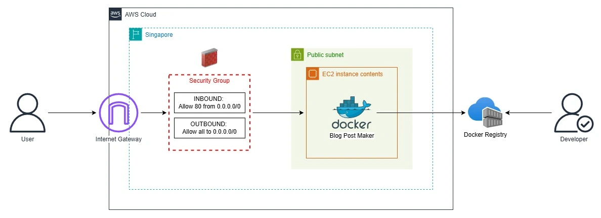

This repository contains the Terraform configurations for provisioning a simple, non-production AWS environment with a VPC, a public subnet, and a publicly-accessible EC2:
> The architecture below is for a simple test, since it doesn't follow AWS' Well-Architected Framework. This is not to be used for production environments.

A deployment pipeline has been prepared for both push & pull request activities that will automatically initialize your Terraform configs, validate it, plan it, and lastly, deploy it to the AWS environment of your choosing (only available for the push-specific workflow).

# Cloning the repository
1. Make sure Terraform installed beforehand in your machine: https://developer.hashicorp.com/terraform/install
2. Clone the repository with `git clone git@github.com:smgestupa/terraform-devops-docker.git` and switch to local repository by `cd terraform-devops-docker`.

# Deploying the Infrastructure
> If you want a simple deployment, specifically deploying thru AWS Lambda, you may check this repository which also has its own deployment pipeline: [smgestupa/express-app](https://github.com/smgestupa/express-app)

> An AWS IAM user with the least amount of permissions to deploy this infrastructure must be prepared beforehand.

1. `AWS_ACCESS_KEY_ID` and `AWS_SECRET_ACCESS_KEY` environment variables must be set in your local machine as they are necessary to deploy the infrastructure to AWS.
2. Initialize the Terraform configs with `terraform init`, then validate it via `terraform validate`.
3. Choose which environment you want to deploy into -- no difference between variables, besides the tags -- as `-var-file=envs/<environment>/env.tfvars` argument is necessary for `terraform plan`, `terraform apply`, and `terraform destroy`.
4. Review the infrastructure to be deployed with `terraform plan -var-file=envs/<environment>/env.tfvars`.
5. Run `terraform apply -var-file=envs/<environment>/env.tfvars` to proceed deploying the infrastructure to the AWS environment of your choosing.
6. You may run `terraform destroy -var-file=envs/<environment>/env.tfvars` to destroy the newly created AWS infrastructure.

## Deploying to AWS via the pipeline
> I'll assume you're forking the repository within GitHub as well.

1. Fork the `smgestupa/terraform-devops-docker` repository.
2. In your newly forked GitHub repository, navigate to **Settings** then click **Actions** under the **Secrets and Variables** dropdown.
3. Click **New repository secret** to add `AWS_ACCESS_KEY_ID` and `AWS_SECRET_ACCESS_KEY` as repository secrets for additional security.
4. Click the **Variables** tab and click **New repository available** to add `TF_VERSION` with a value of your choosing -- the version of Terraform at this time was `1.14.3`.
